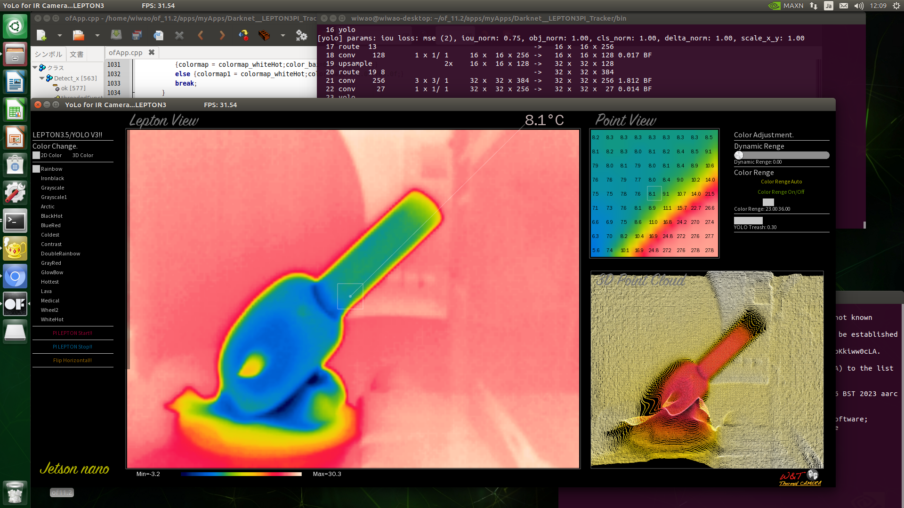

# ThermalCam_Tracker
**Lepton3.0_nano &amp; Darknet_Lepton3PI_Tracker**

## Required main Material
- FLIR Lepton 3.5 or FS https://ctl-commerce.com/shopdetail/000000000044/camera/page1/order/
- Raspberry PI 3 or 4
- Nvidia Jetson Nano or NX or Orin Nano
- Breakout Board for FLIR Lepton
https://ctl-commerce.com/shopdetail/000000000042/

## for Raspberry Pi4B

install Bullseye 32bit according officail instruction.

**$ sudo apt update**

**$ sudo apt upgrade**

**$ sudo nano /boot/config.txt**

#uncomment to overclock the arm. 700 MHz is the default.

over_voltage=5

arm_freq=1000

force_turbo=1

gpu_freq=400

GPU setting to 256

-Change Pi setting
- [x] spi
- [x] ssh
- [x] i2c

or change raspi-config

**$ reboot**

## install OpenFrameworks
https://openframeworks.cc/setup/raspberrypi/raspberry-pi-getting-started/

Install packages and compile openFrameworks:

**$ cd**

wget https://github.com/openframeworks/openFrameworks/releases/download/0.11.2/of_v0.11.2_linuxarmv6l_release.tar.gz

**$ mkdir of_11.2**

**$ tar vxfz of_v0.11.2_linuxarmv6l_release.tar.gz -C of_11.2 --strip-components 1**

**cd /home/pi/of_11.2/scripts/linux/debian**

**yes | sudo ./install_dependencies.sh**

**make Release -C /home/pi/of_11.2/libs/openFrameworksCompiled/project**

**add ofxUI into of_11.2/addons**

**cd of_11.2/addons/**

**git clone https://github.com/rezaali/ofxUI**

copy Lepton3.0_nano to myApps

**$ cd of_11.2/apps/myApps/PI_Lepton3.0_nano_x2**

**($ make clean)**

**$ make -j4**

$ cd bin

**to make run essential to add ip address of Jetson Nano :**

**to display thermal image, you can add whatever ip address for example : ./PI_Lepton3.0_nano_x2　192.168.0.204**

$ cd ~/

$ nano .bashrc

export DISPLAY=:0

## for Raspberry Pi3B

**install Stretch**

https://downloads.raspberrypi.org/raspbian/images/raspbian-2019-04-09/2019-04-08-raspbian-stretch.zip

force_turbo=1

arm_freq=1300

over_voltage=5

**For 3B 16MB GPU memory(G) to 128**

**to compile Openframeworks swapfile to 1024**

**$ sudo nano /etc/dphys-swapfile**

**CONF_SWAPSIZE=1024**

**$ sudo apt update**

**$ sudo apt upgrade**

-Change Pi setting
- [x] spi
- [x] ssh
- [x] i2c

or change raspi-config

**$ reboot**

## install OpenFrameworks for Pi3B (OF_10.1 not OF_11.2)

https://openframeworks.cc/setup/raspberrypi/raspberry-pi-getting-started/

**Install packages and compile openFrameworks:**

**$ cd**

~~wget https://github.com/openframeworks/openFrameworks/releases/download/0.11.2/of_v0.11.2_linuxarmv6l_release.tar.gz~~

**$ wget https://openframeworks.cc/versions/v0.10.1/of_v0.10.1_linuxarmv6l_release.tar.gz**

**$ mkdir of_10.1**

~~$ tar vxfz of_v0.11.2_linuxarmv6l_release.tar.gz -C of_11.2 --strip-components 1~~

**$ tar vxfz of_v0.10.1_linuxarmv6l_release.tar.gz -C of_10.1 --strip-components 1**

**$ cd /home/pi/of_10.1/scripts/linux/debian**

**$ yes | sudo ./install_dependencies.sh**

**$ make Release -C /home/pi/of_10.1/libs/openFrameworksCompiled/project**

**add ofxUI into of_10.1/addons**

**cd of_10.1/addons/**

**git clone https://github.com/rezaali/ofxUI**

copy Lepton3.0_nano to myApps

**$ cd of_10.1/apps/myApps/PI_Lepton3.0_nano_x2**

**($ make clean)**

**$ make -j4**

$ cd bin

**to make run essential to add ip address of Jetson Nano :**

**to display thermal image, you can add whatever ip address for example : ./PI_Lepton3.0_nano_x2　192.168.0.204**

$ cd ~/

$ nano .bashrc

export DISPLAY=:0

## for Jetson Nano(NX and Orin Nano)

### 1. install Jetpak 4.6.1

$ sudo apt update && apt upgrade

$ sudo apt install nano

$ reboot

### 2. install openframeworks

https://openframeworks.cc/setup/armv7/

wget https://github.com/openframeworks/openFrameworks/releases/download/0.11.2/of_v0.11.2_linuxarmv7l_release.tar.gz

tar -zxvf of_v0.11.2_linuxarmv7l_release.tar.gz

mv of_v0.11.2_linuxarmv7l_release of_11.2

cd of_11.2/scripts/linux/ubuntu

sudo ./install_dependencies.sh

--------------------------------------------

1. change to aarch64 as follows;-

     nano of_11.2/libs/openFrameworksCompiled/project/makefileCommon/config.shared.mk

     else ifeq ($(PLATFORM_ARCH),armv7l)

     to as follows;-

     else ifeq ($(PLATFORM_ARCH),aarch64)

3. commentour 4 line and another 3 lines commentout as follows-

     nano of_11.2/libs/openFrameworksCompiled/project/linuxarmv7l/config.linuxarmv7l.default.mk

     #PLATFORM_CFLAGS += -march=armv7

     #PLATFORM_CFLAGS += -mtune=cortex-a8

     #PLATFORM_CFLAGS += -mfpu=neon

     #PLATFORM_CFLAGS += -mfloat-abi=hard

     PLATFORM_CFLAGS += -fPIC

     PLATFORM_CFLAGS += -ftree-vectorize

     PLATFORM_CFLAGS += -Wno-psabi

     PLATFORM_CFLAGS += -pipe

     **--**

     #PLATFORM_PKG_CONFIG_LIBRARIES += glesv1_cm

     #PLATFORM_PKG_CONFIG_LIBRARIES += glesv2

     #PLATFORM_PKG_CONFIG_LIBRARIES += egl

3. exchange KISS and TESS2 file as https://gist.github.com/jvcleave/e49c0b52085d040a5cd8a3385121cb91

     #Download apothecary to recompile kiss and tess2:

     git clone https://github.com/openframeworks/apothecary.git

     cd apothecary/apothecary/

     ./apothecary -t linux download kiss

     ./apothecary -t linux prepare kiss

     ./apothecary -t linux build kiss

     ./apothecary -t linux download tess2

     ./apothecary -t linux prepare tess2

     ./apothecary -t linux build tess2

     $ cp apothecary/apothecary/build/kiss/lib/linux/libkiss.a of_11.2/libs/kiss/lib/linuxarmv7l/

     $ cp apothecary/apothecary/build/tess2_patched/build/libtess2.a of_11.2/libs/tess2/lib/linuxarmv7l/

-------------------

**then go to following directory and run sh file as follows:-**

cd of_11.2/scripts/linux 

./compileOF.sh -j4

**add ofxUI into of_11.2/addons**

cd of_11.2/addons/

git clone https://github.com/rezaali/ofxUI

### 3. Download Darknet__LEPTON3PI_Tracker and copy to of_11.2/apps/myApps/

https://www.dropbox.com/scl/fo/xmnkqvt8058wihsb8aogw/h?rlkey=wkogglwupoqul1bhahl29i2rm&dl=0

### 4. install swapfile

git clone https://github.com/JetsonHacksNano/installSwapfile

cd installSwapfile

./installSwapfile.sh

**check /etc/fstab**

### 5. install OpenCV

wget https://github.com/Qengineering/Install-OpenCV-Jetson-Nano/raw/main/OpenCV-4-8-0.sh

***for Nano no need to edit the sh file but for Jetson NX and Orin Nano edit OpenCV-4-8-0.shas follows;-**

**-D CUDA_ARCH_BIN=5.3 \ in sh file edit to -D CUDA_ARCH_BIN=7.2 \ for NX or to -D CUDA_ARCH_BIN=8.7 \ for Orin Nano**

**refer to CUDA-Enabled Jetosn Produts as compute capability at https://developer.nvidia.com/cuda-gpus**

$ sudo chmod 755 ./OpenCV-4-8-0.sh

$ ./OpenCV-4-8-0.sh

### 6. edit .bash

$ cd ~/

$ nano .bashrc

**add following**

export PATH=/usr/local/cuda/bin:${PATH}

export LD_LIBRARY_PATH=/usr/local/cuda/lib64:${LD_LIBRARY_PATH}

### 7. add linkfile

sudo ln -s /usr/include/opencv4/opencv2 /usr/include/opencv2

### 8. install darknet

git clone https://github.com/AlexeyAB/darknet

**edit makefile : change parameter 0 to 1**

GPU=1

CUDNN=1

CUDNN_HALF=1

OPENCV=1

LIBSO=1

**: commnetout**

\# -gencode arch=compute_61,code=[sm_61,compute_61]

**: delete commnetout**

ARCH= -gencode arch=compute_53,code=[sm_53,compute_53]

**compile**

$ make -j4

### 9. add linkfile

ln -s ~/darknet/src ~/darknet/src1

### (10. delete linkfile before replacing new src1 if already src1 in src, if not, next 11. add new src1 as follows at the same directory)

$ cd of_11.2/apps/myApps/Darknet__LEPTON3PI_Tracker/src

### 11. add new src1 as follows at the same directory

$ ln -s ~/darknet/src1

### 12. edit config.make file

$ nano of_11.2/apps/myApps/Darknet__LEPTON3PI_Trackr/config.make

### 13. change 2 lines from opencv to epencv4

### 14. change ofApp.cpp folloing 3 lines as per the above Raspberry Pi (sshpass -p = Raspberry Pi password to control from Jetson Nano)

char Pi_Lepton_Start[200]="sshpass -p pi ssh pi@raspberrypi.local export DISPLAY=:0 /home/pi/of_11.2/apps/myApps/PI_Lepton3.0_nano_x2/bin/PI_Lepton3.0_nano_x2 ";

char Pi_Lepton_Stop[150]="sshpass -p pi ssh pi@raspberrypi.local sudo pkill -f PI_Lepton3.0_nano_x2 > /dev/null &";

char Pi_Lepton_Stop[150]="sshpass -p pi ssh pi@raspberrypi.local sudo pkill -f PI_Lepton3.0_nano_x2 > /dev/null &";

## After run Lepton3.0_nano with Jetson nano IP address at Raspberry Pi

**$ cd of_11.2/apps/myApps/Darknet__LEPTON3PI_Trackr**

($ make clean）

**$ make -j4**

**$ cd bin**

**$ ./Darknet__LEPTON3PI_Trackr**

# Now you can click `<PILEPTONstart !!/span>` button to run Raspberry Pi apps from Jetson.

